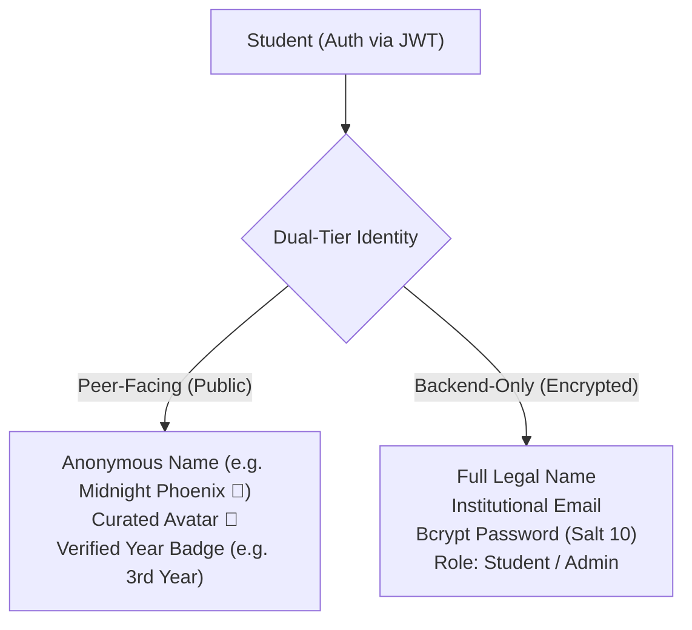

# Prof. S.N. Bose Boys Hostel — Community Platform 🏛️

[](https://react.dev/)
[](https://vitejs.dev/)
[](https://nodejs.org/)
[](https://socket.io/)
[](https://tailwindcss.com/)
[-brightgreen.svg)](file:///server/tests)
[](#-academic-year-architecture)

> **"Your Hostel. Your Voice. Your Community."**
> 
> *A private, real-time web application engineered exclusively for the residents of Prof. S.N. Bose Boys Hostel. Discuss hostel life, ask questions, share notices, participate in polls, and speak freely — all while preserving peer privacy with anonymous personas.*

---

## 🌟 Table of Contents

1. [Project Overview](#-project-overview)
2. [Academic Year Architecture](#-academic-year-architecture)
3. [Dual-Tier Identity & Privacy](#-dual-tier-identity--privacy-guarantees)
4. [Complete Feature Suite](#-complete-feature-suite)
   - [Real-Time Community Rooms](#1-real-time-community-rooms-tasks-13)
   - [Reactions, Deletion & Moderation](#2-community-interaction--moderation-task-4)
   - [Notifications & Unread Tracking](#3-in-app-notifications--unread-tracking-task-5)
   - [Profile & Anonymous Persona Management](#4-profile--persona-customization-task-6)
   - [Announcements, Polls & Pinned Messages](#5-announcements-polls--pinned-messages-task-7)
5. [Technology Stack](#-technology-stack)
6. [System Directory Structure](#-system-directory-structure)
7. [Database Schemas & Data Models](#-database-schemas--data-models)
8. [Room Authorization Matrix](#-room-authorization-matrix)
9. [REST API Documentation](#-rest-api-documentation)
10. [Socket.IO Real-Time Event Architecture](#-socketio-real-time-event-architecture)
11. [Testing & Quality Assurance](#-testing--quality-assurance)
12. [Getting Started & Local Setup](#-getting-started--local-setup)

---

## 🌟 Project Overview

**Prof. S.N. Bose Boys Hostel Community** resolves a classic university challenge: students often hesitate to ask honest questions, provide candid feedback on mess/amenities, or discuss hostel initiatives due to peer judgment, senior-junior dynamics, or social pressure.

This platform bridges that gap by combining **peer privacy** with **institutional accountability**:
- Students interact with rotating pseudonyms and curated avatar personas.
- All real-time messaging, emoji reactions, announcements, and community votes are synchronized instantly via Socket.IO.
- Hostel administration retains moderation capabilities, bulletin broadcast tools, and community poll management.

---

## 🏛️ Academic Year Architecture

Prof. S.N. Bose Boys Hostel strictly accommodates:
- **🎓 2nd Year**
- **🎓 3rd Year**
- **🎓 4th Year**

> [!IMPORTANT]
> **Strict Rule:** There is **NO 1st Year** in this hostel. All backend schemas, registration dropdowns, authorization guards, automated tests, and UI components enforce this rule. Any request attempting to inject a 1st-year reference is rejected at the API validation boundary.

---

## 🛡️ Dual-Tier Identity & Privacy Guarantees



1. **Zero Real-Name Exposure:** Other students only ever see `anonymousName`, `anonymousAvatar`, and `year`. Full names, emails, and passwords are never transmitted in community payloads.
2. **Hostel Administration Privacy:** When announcements or admin actions are taken, the system masks the administrator's identity as **"Hostel Administration"**, preventing personal bias or targetting.
3. **Secret Voting:** Poll votes are counted accurately while keeping the voter's specific choice confidential.
4. **Honest Communication:** While personas protect students from peer judgment, backend session accountability maintains a respectful, harassment-free environment.

---

## ✨ Complete Feature Suite

### 1. Real-Time Community Rooms (Tasks 1–3)
- **🌍 Global Room:** Open to all registered hostel residents (2nd, 3rd, and 4th Year).
- **🎓 2nd Year Room:** Exclusive, private channel for 2nd Year residents.
- **🎓 3rd Year Room:** Exclusive, private channel for 3rd Year residents.
- **🎓 4th Year Room:** Exclusive, private channel for 4th Year residents.
- **Instant Synchronization:** Messages stream via Socket.IO with sub-100ms latency.
- **Strict Authorization:** Server-side room checks return `403 Forbidden` and `room_error` if a student attempts to access another year's channel.

### 2. Community Interaction & Moderation (Task 4)
- **Message Reactions:** One-click emoji reactions (`👍`, `❤️`, `😂`, `😮`, `😢`, `🔥`, `👏`) with real-time peer count updates. Students can toggle reactions on/off.
- **Message Soft Deletion:** Students can delete their own messages. Deletions show a gentle tombstone: *"This message was deleted"* while maintaining conversation continuity.
- **Inappropriate Content Reporting:** Students can report abusive messages with categorized reasons (`harassment`, `spam`, `inappropriate`, `hate_speech`, `other`). Duplicate reports from the same student are prevented.
- **Admin Moderation Hub:** Hostel administrators can review flagged messages, dismiss false reports, or remove infringing content permanently.

### 3. In-App Notifications & Unread Tracking (Task 5)
- **Per-Room Unread Counters:** Real-time badges display exactly how many unseen messages exist in each room.
- **RoomReadState Tracking:** MongoDB tracks each student's `lastReadAt` timestamp per room. Own messages and soft-deleted messages are excluded from unread counts.
- **Automatic Mark-Read:** Navigating to a room or refocusing the window automatically clears unread badges and emits `room_read`.
- **Global Notification Bell:** Header dropdown displays live notifications for system bulletins, report actions, and community alerts with one-click "Mark All as Read".

### 4. Profile & Persona Customization (Task 6)
- **Dedicated Profile Studio (`/profile`):** Students can manage their hostel persona anytime.
- **12 Curated Avatars:** Choose from high-fidelity, hostel-themed avatars (`Panda 🐼`, `Falcon 🦅`, `Owl 🦉`, `Tiger 🐯`, `Wolf 🐺`, `Fox 🦊`, `Lion 🦁`, `Bear 🐻`, `Koala 🐨`, `Dragon 🐉`, `Rocket 🚀`, `Atom ⚛️`).
- **Anonymous Name Customizer:** Update your community alias within safe character lengths (2–30 chars).
- **Secure Password Changes:** Students can update their password securely by verifying their current password.

### 5. Announcements, Polls & Pinned Messages (Task 7)
- **Official Hostel Announcements:**
  - Administrative notices displayed on the dashboard and pinned to room banners.
  - Priority levels: `normal` (sky), `important` (amber), `urgent` (rose).
  - Target rooms: Broadcast globally or target specific year channels.
  - Expiration support: Automatic pruning of expired bulletins.
- **Interactive Community Polls:**
  - Admin-created polls with 2 to 6 options.
  - Live percentage bars and real-time vote recalculation via Socket.IO.
  - Configurable vote changing (`allowVoteChange: true/false`).
  - Strict voter anonymity — vote totals increment without exposing individual student choices.
- **Pinned Messages in Chat:**
  - Administrators can pin important messages in any room.
  - Persistent pinned message banner in the chat header with instant jump-to-message preview.

---

## 🏗️ Technology Stack

| Layer | Technology | Purpose |
| :--- | :--- | :--- |
| **Frontend UI** | **React 19** + **Vite 8** | Ultra-fast component rendering and HMR development |
| **Styling** | **Tailwind CSS v4** + Glassmorphism | Modern hostel aesthetic, dark-mode styling, responsive layouts |
| **Routing** | **React Router v7** | Public/Protected route guards, seamless client-side navigation |
| **Icons** | **Lucide React** | Clean, modern iconography |
| **Backend Runtime** | **Node.js (ES Modules)** | Asynchronous, event-driven server runtime |
| **API Framework** | **Express.js 4** | Modular REST routes, middleware pipeline, centralized error handling |
| **Real-Time Engine**| **Socket.IO v4** | Bi-directional WebSocket communication with JWT handshake auth |
| **Database** | **MongoDB** + **Mongoose** | Document persistence, compound indexing, strict schema validations |
| **Security** | **BcryptJS**, **Helmet**, **CORS** | Password salting, secure HTTP headers, cross-origin protection |
| **Testing** | **Node.js Native Test Runner** | 90 automated unit & integration tests across 11 suites |

---

## 📁 System Directory Structure

```text
hostel-community/
├── client/
│   ├── public/
│   │   └── logo.svg                     # S.N. Bose physics & anonymity emblem
│   ├── src/
│   │   ├── components/                  # Reusable UI components
│   │   │   ├── AnnouncementCard.jsx     # Pinned & standard announcement cards
│   │   │   ├── AnonymousIdentity.jsx    # Persona preview and visual badge
│   │   │   ├── AvatarPicker.jsx         # 12-avatar visual selection grid
│   │   │   ├── CommunityPreview.jsx     # Room cards with real-time unread badges
│   │   │   ├── MessageBubble.jsx        # Chat bubble with reactions, report, delete, pin
│   │   │   ├── Navbar.jsx               # Navigation bar with notification bell & profile link
│   │   │   ├── NotificationDropdown.jsx # Live in-app notifications drawer
│   │   │   ├── PollCard.jsx             # Interactive live community poll with percentages
│   │   │   ├── ProtectedRoute.jsx       # Auth guard redirecting to /login
│   │   │   └── PublicRoute.jsx          # Auth guard redirecting to /dashboard
│   │   ├── context/
│   │   │   ├── AuthContext.jsx          # JWT authentication and user profile state
│   │   │   └── CommunityContext.jsx     # Global community unread state
│   │   ├── pages/
│   │   │   ├── AdminAnnouncements.jsx   # Admin bulletin, poll & announcement studio
│   │   │   ├── ChatPage.jsx             # Real-time room chat with pinned message drawer
│   │   │   ├── Dashboard.jsx            # Student dashboard with feeds, rooms, and polls
│   │   │   ├── LandingPage.jsx          # Premium landing showcase
│   │   │   ├── Login.jsx                # Student login portal
│   │   │   ├── ProfilePage.jsx          # Identity customizer & password management
│   │   │   └── Register.jsx             # Registration with strict 2nd/3rd/4th Year selection
│   │   ├── services/
│   │   │   ├── announcementService.js   # Announcement API client
│   │   │   ├── authService.js           # Auth & session API client
│   │   │   ├── notificationService.js   # Notification API client
│   │   │   ├── pollService.js           # Poll voting API client
│   │   │   ├── profileService.js        # Profile & persona API client
│   │   │   ├── roomService.js           # Room messages & unread API client
│   │   │   └── socketService.js         # Socket.IO client manager
│   │   ├── App.jsx                      # Route configuration
│   │   └── index.css                    # Tailwind CSS v4 design tokens
│   └── vite.config.js                   # Vite bundler configuration
│
├── server/
│   ├── config/
│   │   └── db.js                        # Resilient MongoDB connection
│   ├── controllers/
│   │   ├── announcement.controller.js   # Announcement CRUD & filtering
│   │   ├── auth.controller.js           # Register, login, getMe
│   │   ├── message.controller.js        # Reactions, deletion, reports, pins
│   │   ├── notification.controller.js   # Notifications & read status
│   │   ├── poll.controller.js           # Poll creation, voting, closing
│   │   ├── profile.controller.js        # Profile updates & password changes
│   │   └── room.controller.js           # Room discovery & unread counter
│   ├── middleware/
│   │   ├── auth.middleware.js           # Bearer JWT verification & admin guard
│   │   └── errorHandler.js              # Centralized JSON error response handler
│   ├── models/
│   │   ├── Announcement.js              # Hostel announcements with priority & expiry
│   │   ├── Message.js                   # Chat messages with reactions & pin flags
│   │   ├── Notification.js              # User-specific in-app notifications
│   │   ├── Poll.js                      # Community polls with options & vote tallies
│   │   ├── PollVote.js                  # Secret voter ballots (prevents duplicate votes)
│   │   ├── Report.js                    # Message abuse reports queue
│   │   ├── Room.js                      # Community rooms (Global, 2nd, 3rd, 4th Year)
│   │   ├── RoomReadState.js             # User read timestamp tracker per room
│   │   └── User.js                      # User model with bcrypt hashing & anonymous persona
│   ├── routes/
│   │   ├── admin.routes.js              # Moderation management routes
│   │   ├── announcement.routes.js       # Announcement routes
│   │   ├── api.routes.js                # Master route aggregator
│   │   ├── auth.routes.js               # Auth routes
│   │   ├── message.routes.js            # Message actions routes
│   │   ├── notification.routes.js       # Notification routes
│   │   ├── poll.routes.js               # Poll routes
│   │   ├── profile.routes.js            # Profile routes
│   │   └── room.routes.js               # Room & message routes
│   ├── services/
│   │   ├── announcement.service.js      # Announcement logic & expiry validation
│   │   ├── identity.service.js          # Procedural anonymous persona generator
│   │   ├── notification.service.js      # In-app notification creation & dispatch
│   │   ├── poll.service.js              # Poll calculation, percentages & vote switching
│   │   ├── profile.service.js           # Persona updates & password security
│   │   └── room.service.js              # Room seeding & unread count aggregation
│   ├── socket/
│   │   └── chat.socket.js               # Socket.IO gateway (chat, reactions, pins, polls)
│   └── tests/                           # 11 automated test suites (90 passing tests)
│
├── package.json                         # Root monorepo concurrency orchestrator
└── README.md                            # Comprehensive project guide
```

---

## 🗄️ Database Schemas & Data Models

### 1. Announcement Schema (`server/models/Announcement.js`)
```javascript
{
  title: { type: String, required: true, trim: true, maxlength: 150 },
  content: { type: String, required: true, trim: true, maxlength: 2000 },
  priority: { type: String, enum: ['normal', 'important', 'urgent'], default: 'normal' },
  isPinned: { type: Boolean, default: false },
  room: { type: mongoose.Schema.Types.ObjectId, ref: 'Room', required: true },
  createdBy: { type: mongoose.Schema.Types.ObjectId, ref: 'User', required: true },
  expiresAt: { type: Date, default: null },
  isActive: { type: Boolean, default: true }
}
```

### 2. Poll & PollVote Schema (`server/models/Poll.js` & `PollVote.js`)
```javascript
// Poll
{
  question: { type: String, required: true, trim: true, maxlength: 300 },
  options: [{
    text: { type: String, required: true, trim: true },
    voteCount: { type: Number, default: 0 }
  }],
  room: { type: mongoose.Schema.Types.ObjectId, ref: 'Room', required: true },
  createdBy: { type: mongoose.Schema.Types.ObjectId, ref: 'User', required: true },
  isClosed: { type: Boolean, default: false },
  allowVoteChange: { type: Boolean, default: true },
  totalVotes: { type: Number, default: 0 },
  expiresAt: { type: Date, default: null }
}

// PollVote (Ensures single vote per student while keeping voting secret)
{
  poll: { type: mongoose.Schema.Types.ObjectId, ref: 'Poll', required: true, index: true },
  user: { type: mongoose.Schema.Types.ObjectId, ref: 'User', required: true, index: true },
  optionIndex: { type: Number, required: true }
}
// Unique compound index: { poll: 1, user: 1 }
```

### 3. RoomReadState Schema (`server/models/RoomReadState.js`)
```javascript
{
  user: { type: mongoose.Schema.Types.ObjectId, ref: 'User', required: true, index: true },
  room: { type: mongoose.Schema.Types.ObjectId, ref: 'Room', required: true, index: true },
  lastReadAt: { type: Date, default: Date.now }
}
// Unique compound index: { user: 1, room: 1 }
```

### 4. Message Schema (`server/models/Message.js`)
```javascript
{
  room: { type: mongoose.Schema.Types.ObjectId, ref: 'Room', required: true, index: true },
  sender: { type: mongoose.Schema.Types.ObjectId, ref: 'User', required: true, index: true },
  content: { type: String, required: true, trim: true, maxlength: 1000 },
  isDeleted: { type: Boolean, default: false },
  deletedAt: { type: Date, default: null },
  isPinned: { type: Boolean, default: false },
  pinnedAt: { type: Date, default: null },
  pinnedBy: { type: mongoose.Schema.Types.ObjectId, ref: 'User', default: null },
  reactions: [{
    emoji: { type: String, enum: ['thumbsup', 'heart', 'laugh', 'surprised', 'sad', 'fire', 'clap'] },
    users: [{ type: mongoose.Schema.Types.ObjectId, ref: 'User' }]
  }]
}
```

---

## 🛡️ Room Authorization Matrix

| Authenticated Student | 🌍 Global Room | 🎓 2nd Year Room | 🎓 3rd Year Room | 🎓 4th Year Room |
| :--- | :---: | :---: | :---: | :---: |
| **2nd Year Student** | ✅ Allowed | ✅ Allowed | ⛔ 403 Forbidden | ⛔ 403 Forbidden |
| **3rd Year Student** | ✅ Allowed | ⛔ 403 Forbidden | ✅ Allowed | ⛔ 403 Forbidden |
| **4th Year Student** | ✅ Allowed | ⛔ 403 Forbidden | ⛔ 403 Forbidden | ✅ Allowed |

- All REST endpoints (`/api/rooms/:slug`, `/api/rooms/:roomId/messages`, `/api/rooms/:roomId/read`) enforce this matrix.
- Socket.IO gateway validates credentials upon `join_room` and rejects unauthorized sockets with `room_error`.

---

## 🔑 REST API Documentation

### Authentication & Profile
| Method | Endpoint | Access | Description |
| :--- | :--- | :--- | :--- |
| `POST` | `/api/auth/register` | Public | Register student with year (`2nd Year`, `3rd Year`, `4th Year`). Generates anonymous persona. |
| `POST` | `/api/auth/login` | Public | Authenticates credentials and returns JWT Bearer token. |
| `GET` | `/api/auth/me` | Authenticated | Fetches current student profile and community identity. |
| `GET` | `/api/profile` | Authenticated | Detailed profile data including available avatars and current settings. |
| `PATCH` | `/api/profile/identity` | Authenticated | Updates student's `anonymousName` and `anonymousAvatar`. |
| `POST` | `/api/profile/change-password`| Authenticated | Safely updates account password after validating old password. |

### Rooms & Unread Messages
| Method | Endpoint | Access | Description |
| :--- | :--- | :--- | :--- |
| `GET` | `/api/rooms` | Authenticated | Returns authorized rooms for the logged-in student. |
| `GET` | `/api/rooms/unread` | Authenticated | Returns unread message count map for all authorized rooms. |
| `GET` | `/api/rooms/:slug` | Authenticated | Returns room details if authorized (403 if unauthorized). |
| `GET` | `/api/rooms/:roomId/messages` | Authenticated | Paginated message feed with reactions and pinned status. |
| `POST` | `/api/rooms/:roomId/messages` | Authenticated | Sends a new message (1–1000 chars). |
| `PATCH` | `/api/rooms/:roomId/read` | Authenticated | Updates student's `lastReadAt` and resets room unread count to 0. |
| `GET` | `/api/rooms/:roomId/pinned` | Authenticated | Returns all pinned messages for the room. |

### Message Actions & Reactions
| Method | Endpoint | Access | Description |
| :--- | :--- | :--- | :--- |
| `POST` | `/api/messages/:id/reaction` | Authenticated | Adds or toggles an emoji reaction on a message. |
| `DELETE`| `/api/messages/:id/reaction/:emoji` | Authenticated | Removes an emoji reaction from a message. |
| `DELETE`| `/api/messages/:id` | Owner / Admin | Soft-deletes a message (replaces content with deleted placeholder). |
| `POST` | `/api/messages/:id/report` | Authenticated | Reports an inappropriate message with reason. |
| `PATCH` | `/api/messages/:id/pin` | Admin Only | Pins an important message to the room. |
| `PATCH` | `/api/messages/:id/unpin` | Admin Only | Unpins a message from the room. |

### Announcements & Polls
| Method | Endpoint | Access | Description |
| :--- | :--- | :--- | :--- |
| `GET` | `/api/announcements` | Authenticated | Returns active announcements for student's authorized rooms. |
| `POST` | `/api/announcements` | Admin Only | Creates an announcement with priority, pin, and expiration. |
| `PATCH` | `/api/announcements/:id` | Admin Only | Updates announcement details or toggle pin status. |
| `DELETE`| `/api/announcements/:id` | Admin Only | Deletes an announcement. |
| `GET` | `/api/polls` | Authenticated | Returns active polls with vote counts, percentages, and user vote status. |
| `POST` | `/api/polls` | Admin Only | Creates a community poll (2–6 options, optional vote switching). |
| `POST` | `/api/polls/:id/vote` | Authenticated | Casts or updates vote for an option. Strict voter privacy. |
| `PATCH` | `/api/polls/:id/close` | Admin Only | Closes poll to prevent further votes. |

### Notifications & Moderation
| Method | Endpoint | Access | Description |
| :--- | :--- | :--- | :--- |
| `GET` | `/api/notifications` | Authenticated | Returns list of recent notifications with unread count. |
| `PATCH` | `/api/notifications/:id/read` | Authenticated | Marks a specific notification as read. |
| `PATCH` | `/api/notifications/read-all` | Authenticated | Marks all notifications as read. |
| `GET` | `/api/admin/reports` | Admin Only | Fetches pending content moderation reports. |
| `POST` | `/api/admin/reports/:id/resolve` | Admin Only | Resolves report (action: dismiss or delete message). |

---

## ⚡ Socket.IO Real-Time Event Architecture

### Connection Handshake
Clients authenticate during the WebSocket handshake using their JWT:
```javascript
const socket = io('http://localhost:5000', {
  auth: { token: localStorage.getItem('snbose_auth_token') }
});
```

### Event Registry
| Event Name | Direction | Payload | Description |
| :--- | :---: | :--- | :--- |
| `join_room` | Client ➔ Server | `{ roomId }` | Joins room after validating year authorization. |
| `leave_room` | Client ➔ Server | `{ roomId }` | Leaves room channel. |
| `send_message` | Client ➔ Server | `{ roomId, content }` | Posts a message; notifies room members. |
| `new_message` | Server ➔ Room | `{ id, content, sender, createdAt, ... }` | Broadcast to all room occupants. |
| `add_reaction` | Client ➔ Server | `{ messageId, emoji, roomId }` | Reacts with an emoji. |
| `remove_reaction`| Client ➔ Server | `{ messageId, emoji, roomId }` | Removes reaction. |
| `reaction_updated`| Server ➔ Room | `{ messageId, reactions }` | Broadcast updated reaction counts. |
| `delete_message` | Client ➔ Server | `{ messageId, roomId }` | Soft-deletes user's message. |
| `message_deleted` | Server ➔ Room | `{ messageId }` | Broadcasts deletion tombstone. |
| `pin_message` | Client ➔ Server | `{ messageId, roomId }` | Admin pins a message. |
| `message_pinned` | Server ➔ Room | `{ messageId, isPinned, message }` | Broadcasts pinned state change. |
| `poll_updated` | Server ➔ Room | `{ poll }` | Live updates poll vote tallies & percentages. |
| `room_read` | Client ➔ Server | `{ roomId }` | Marks room as read and syncs badge across sessions. |
| `unread_counts_updated` | Server ➔ User | `{ counts: { [roomId]: number } }` | Updates client unread badges. |
| `new_notification` | Server ➔ User | `{ notification }` | Dispatches real-time notification alert. |

---

## 🧪 Testing & Quality Assurance

The platform features an automated test suite executed with the Node.js test runner against an in-memory or test database:

```bash
cd server
npm test
```

### Test Coverage Highlights:
- **11 Test Suites, 90 Automated Tests, 100% Pass Rate.**
- **Auth & JWT Suite:** Registration, login, password hashing, token validation, persona assignment.
- **Room Authorization Suite:** Verification of strict access rules (2nd, 3rd, 4th Year permissions, 403 rejections).
- **Zero 1st-Year Integrity:** Absolute confirmation that 1st Year does not exist anywhere in schemas, dropdowns, or databases.
- **Reactions & Soft-Delete Suite:** Emoji validation, multiple reactions, owner-only deletion enforcement.
- **Reporting & Moderation Suite:** Abuse reporting, duplicate report prevention, admin dismissal and removal.
- **Unread & Read State Suite:** Unread badge increments, exclusion of own/deleted messages, mark-read resets.
- **Profile & Password Suite:** Persona modification, 12-avatar validation, password change validation.
- **Announcements Suite:** Creation, room scoping, expiry pruning, pinned announcements.
- **Polls Suite:** Multi-option creation, vote calculation, percentage precision, vote switching, voter anonymity.
- **Pinned Messages Suite:** Admin-only pin/unpin toggles and room retrieval.

---

## 🚀 Getting Started & Local Setup

### Prerequisites
- **Node.js** (v18.x or v20.x+)
- **npm** (v9.x+)
- **MongoDB** (Local instance running at `mongodb://127.0.0.1:27017` or MongoDB Atlas URI)

### 1. Clone the Repository
```bash
git clone https://github.com/biswasayan833-crypto/SN-Bose-Boy-s-Hostel.git
cd SN-Bose-Boy-s-Hostel
```

### 2. Configure Environment Variables

#### Backend (`server/.env`):
```env
PORT=5000
NODE_ENV=development
MONGO_URI=mongodb://127.0.0.1:27017/snbose_community
JWT_SECRET=super_secret_jwt_key_snbose_hostel_2026_production
JWT_EXPIRES_IN=7d
CLIENT_URL=http://localhost:5173
```

#### Frontend (`client/.env`):
```env
VITE_API_URL=http://localhost:5000/api
VITE_SOCKET_URL=http://localhost:5000
```

### 3. Install Dependencies
```bash
# Install root dependencies
npm install

# Install client and server dependencies
npm run install:all
```

### 4. Run the Full Application
```bash
# Concurrently launches both Vite frontend (5173) and Express backend (5000)
npm run dev
```

- **Frontend Application:** `http://localhost:5173`
- **Backend API & Sockets:** `http://localhost:5000`
- **API Health Check:** `http://localhost:5000/api/health`

### 5. Production Build
```bash
cd client
npm run build
```

---

## 📜 Code of Conduct & Privacy Philosophy

1. **Be Respectful:** Although identities are anonymous to fellow students, all residents are peers sharing the same hostel. Treat everyone with dignity.
2. **Constructive Feedback:** Use the platform to improve mess food, sports facilities, cleanliness, room maintenance, and hostel events.
3. **No Harassment:** Content that promotes harassment, bullying, or hate speech will be moderated and removed by hostel administration.
4. **Institutional Security:** Anonymity is peer-facing. Backend records ensure hostel safety and accountability.

---

<div align="center">
  <p>Dedicated to the students and legacy of <b>Prof. Satyendra Nath Bose</b></p>
  <p><sub>Built with ❤️ for Prof. S.N. Bose Boys Hostel</sub></p>
</div>
